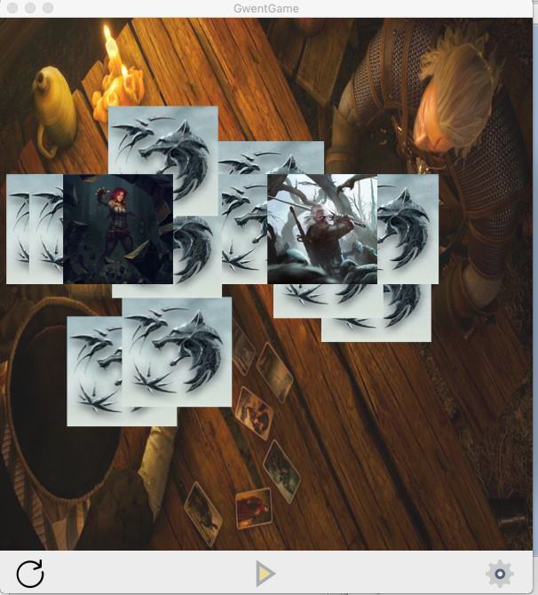
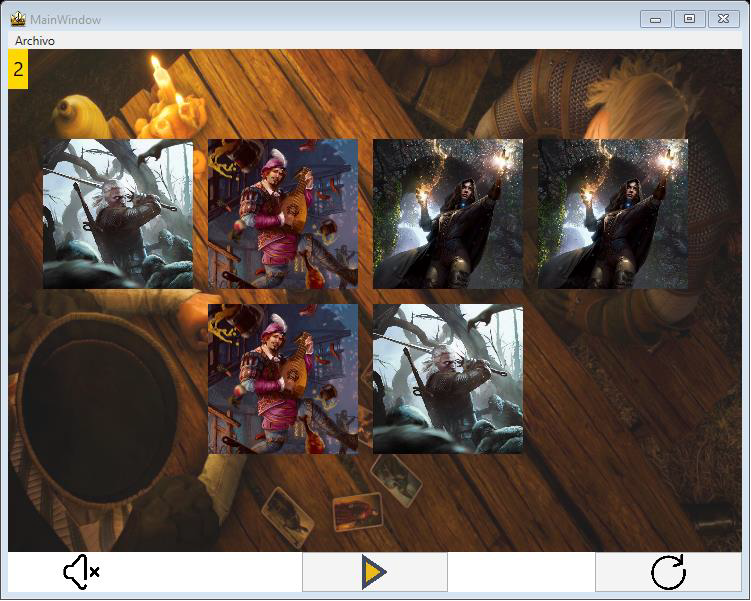

# Memory Card Game

- Proyecto realizado entre Octubre y Diciembre 2019
- Para la asignatura Interfaces Graficas de Usuario de Ingeniería Informatica de la Universidad de Salamanca

## Descripción
- Juego de cartas que consiste en encontrar las parejas de cada carta
- Realizado en Cocoa (MacOS) y WPF (Windows) 
- Gwent y The Witcher son marcas registradas de Andrzej Sapkowski y CD Projekt, y su uso ha sido con fines educativos. 

## Cocoa
- [Manual de instrucciones y del programador](ManualCocoa.pdf)

## Windows
- [Manual de instrucciones y del programador](ManualWindows.pdf)

